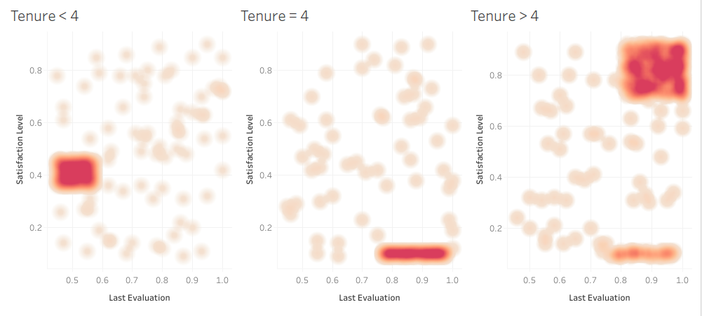
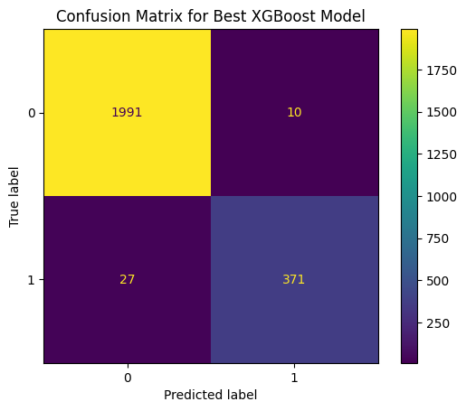
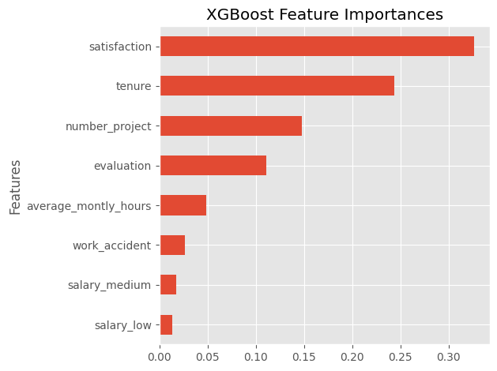
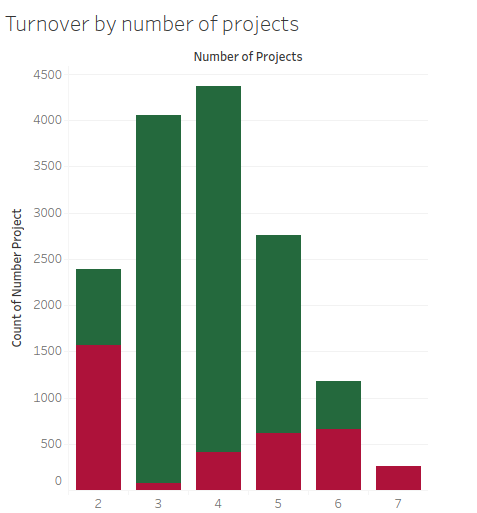

# Gradient Boosting for Employee Turnover Prediction

## Overview

The goal of this project is to create a model that allows a company's HR department predict when employees are likely to leave the company. This phenomena could be caused by the employee either being laid off or voluntarily quitting and it will be addressed as **turnover**. The data on which to train the model has been collected by the HR department. 

The final model has a 98.29% accuracy and 91.78% recall identifying employees who will leave the company. The most influential factors are:

 - Self reported satisfaction level
 - Time spent working for the company
 - Number of projects the employee contributes to
 - Score of employee's last performance review
 

## Business Understanding

For a company employee turnover is an undesirable but sometimes necessary event. Here a clear division can be done depending on where the decision is made. 

If the company makes the choice to fire a given employee it, most likely, means that they don't reach the company's standards (measured by the evaluation index) and the company may be better off letting them go and looking for new hires. 

The second scenario involves the employee making the choice of leaving. In most cases (within the given data set) employees who voluntarily leave the company could be further divided by their satisfaction index. 
One could imagine that the reasons for someone leaving the company with a low satisfaction index (e.g. not feeling valued or having personal disagreements with other coworkers) and someone also leaving but with high satisfaction (e.g. getting a better offer from a competitor) are different.

These distinctions are important to understand how these factors influence turnover in order for HR to make adjustments to reduce it. 

## Data Understanding

The provided dataset contains data about **11990 unique employees**  of which a **16.6% left the company**. Each entry has 10 features corresponding to data collected by the HR department about each employee.  

Before starting a deeper analysis, there are some patterns worth pointing out: When filtered by tenure, the employee's who left the company tend to aggregate in certain regions of the Evaluation vs Satisfaction graph. 

As stated in the previous epigraph, one can imagine that the reasons for leaving the company are different for different regions of the graph.
 
## Modeling and Evaluation

Gradient boosting (gradient descent) was selected as the ideal model for this project. One of the reasons being that the data doesn't show any strong linear relationship between the features and the target. To find the optimal hyperparameters the metric selected was **f1**. The best model, using 100 decision tress, correctly classified 98.29% of the data provided outside of the training set. The following is a summary of the results for the model:

After this result, the hyperparameters were tuned again, this time aiming to optimize  **recall**. This was done because, in this particular scenario, false negatives are less desirable than false positives. This second model didn't perform better than the first one, and so it was discarded.

The following graph shows the most influential factors.

Is important to mention that tenure may be an important factor related to the clustering as described in the previous epigraph. Employees with not too high satisfaction and very low evaluation tend to leave the company (presumably getting fired) only when their tenure is below 4 years. The same region of the graph is quite depopulated for tenure above 4 years.  

Seeing these results, in particular that the number of projects seems to be highly influential, further inspection on this was needed and a new pattern was revealed.

Even though the distribution of number of projects among employees (red + green) is quasi-normal, the distribution of employees who leave the company (red) has two clear modes. This is one of the examples of a highly influential feature not having a clear linear relationship with the target.

## Conclusion

This model could inform the HR department on ways to reduce employee turnover by trying to affect it's lead measures. 